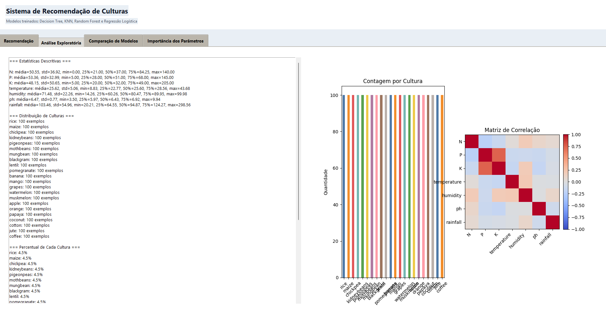
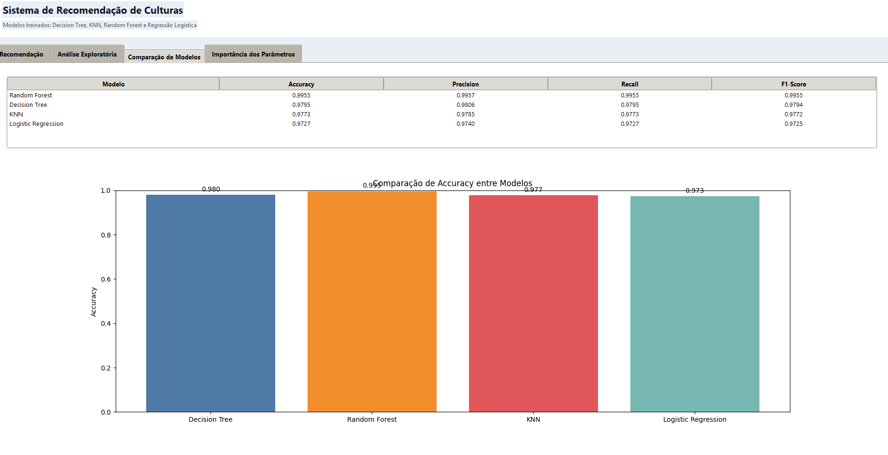
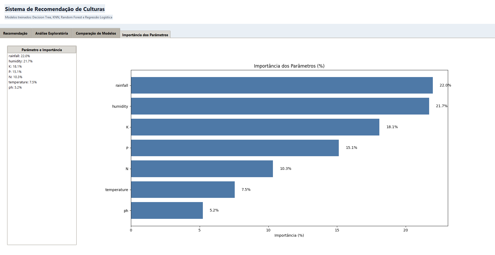
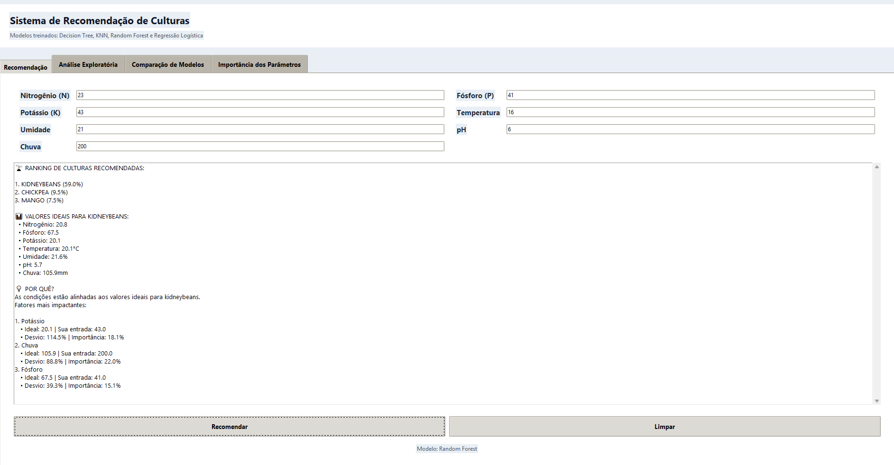

# 🌱 Recomendação de Culturas com Machine Learning

Projeto desenvolvido para a disciplina de **IA para Mineração de Dados**, com o objetivo de recomendar a cultura agrícola mais adequada com base em características do solo e condições climáticas.

---

## 🎯 Objetivo

Desenvolver e comparar algoritmos de Machine Learning capazes de recomendar culturas agrícolas utilizando informações do solo e do ambiente.

Além da comparação dos modelos e da análise de importância dos parâmetros, foi desenvolvido um sistema interativo onde o usuário informa as condições da propriedade rural e recebe uma recomendação automática da cultura mais adequada.

---

## 📊 Dataset

Dataset utilizado:

**Crop Recommendation Dataset**

O conjunto de dados contém informações agronômicas utilizadas para determinar a cultura mais adequada para plantio.

### Variáveis utilizadas

- Nitrogênio (N) — kg/ha
- Fósforo (P) — kg/ha
- Potássio (K) — kg/ha
- Temperatura — °C
- Umidade — %
- pH
- Chuva — mm

### Variável alvo

- Cultura recomendada

O dataset possui recomendações para 22 culturas agrícolas diferentes.

---

## 🔎 Análise Exploratória dos Dados

Foi realizada uma análise exploratória para compreender o comportamento das variáveis e identificar padrões presentes nos dados.

### Estatísticas Descritivas

Foram analisados:

- Média
- Mediana
- Desvio padrão
- Valores mínimos
- Valores máximos

### Visualização dos Dados



---

## 🤖 Algoritmos Avaliados

Foram comparados os seguintes algoritmos de classificação:

- Decision Tree
- Random Forest
- K-Nearest Neighbors (KNN)
- Logistic Regression

---

## 📈 Resultados Obtidos

### Comparação dos Modelos

| Modelo | Accuracy |
|----------|----------|
| Random Forest | 99,55% |
| Logistic Regression | 98,18% |
| Decision Tree | 97,95% |
| KNN | 97,73% |

### Gráfico de Comparação



---

## 🏆 Melhor Modelo

O melhor desempenho foi obtido pelo algoritmo:

### Random Forest

Accuracy:

**99,55%**

O modelo apresentou excelente capacidade de generalização e foi escolhido para o sistema final de recomendação.

---

## 🌾 Importância dos Parâmetros

A análise de importância dos parâmetros mostrou quais atributos tiveram maior influência na decisão do modelo.

Principais fatores:

1. Rainfall (Chuva)
2. Humidity (Umidade)
3. Potassium (K)
4. Phosphorus (P)
5. Nitrogen (N)

### Gráfico de Importância



---

## 💻 Sistema de Recomendação

Foi desenvolvido um sistema interativo em uma única aplicação, com as seguintes abas:

- **Recomendação** — informe as condições do solo e do clima e receba o ranking das culturas mais adequadas
- **Análise Exploratória** — estatísticas descritivas e visualizações do dataset
- **Comparação de Modelos** — métricas e gráfico de desempenho dos algoritmos
- **Importância dos Parâmetros** — variáveis que mais influenciam a decisão do modelo

### Exemplo de utilização

Entrada:

```text
Nitrogênio (N, kg/ha): 90
Fósforo (P, kg/ha): 42
Potássio (K, kg/ha): 43
Temperatura (°C): 21
Umidade (%): 82
pH: 6.5
Chuva (mm): 203
```

Saída:

```text
1. RICE (98.2%)
2. JUTE (1.1%)
3. COCONUT (0.4%)
```

### Exemplo do Sistema



---

## 📂 Estrutura do Projeto

```text
recomendacao_de_culturas_com_machine_learning/

├── Crop_recommendation.csv
├── recomendador_cultura.py
├── requirements.txt
├── README.md
│
└── images/
    ├── print_analise_exploratoria.png
    ├── print_modelos.png
    ├── print_parametros.png
    └── print_recomendacao.png
```

---

## ⚙️ Como Executar

### 1. Clonar o repositório

```bash
git clone https://github.com/RicardoColli/recomendacao_de_culturas_com_machine_learning.git
```

### 2. Instalar as dependências

```bash
pip install -r requirements.txt
```

### 3. Executar o sistema

```bash
python recomendador_cultura.py
```

A aplicação abre a interface gráfica com todas as funcionalidades do projeto: recomendação, análise exploratória, comparação de modelos e importância dos parâmetros.

---

## 🛠 Tecnologias Utilizadas

- Python
- Pandas
- NumPy
- Matplotlib
- Scikit-Learn

---

## 👨‍🎓 Trabalho Acadêmico

Projeto desenvolvido para aplicação prática do processo de Mineração de Dados utilizando técnicas de Machine Learning para recomendação de culturas agrícolas.
